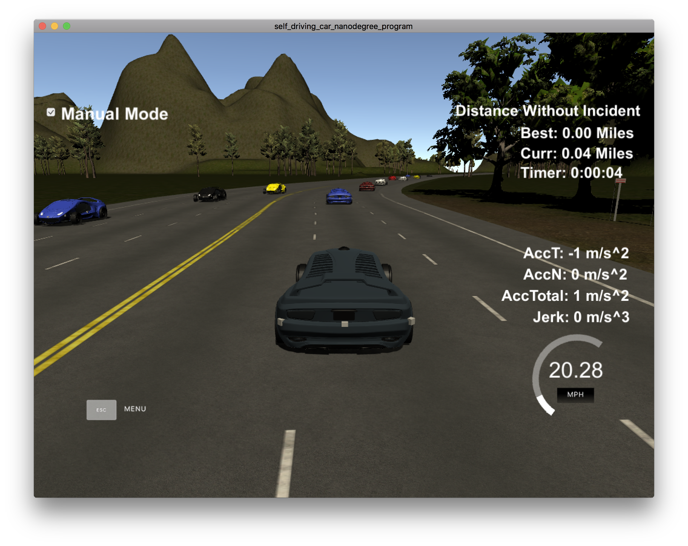
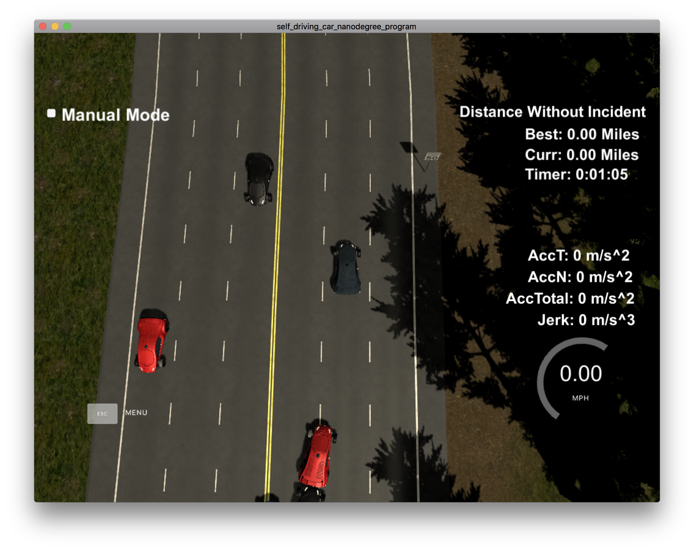

# Prolog Project (MMN-17)

## <mark>TODO</mark>

- understand and write down exact world representation
- get vehicle to drive straight
- test swipl bridge (it's called a 

## Overview

Prolog based autonomous vehicle path planning expert system. 

[Link to paper 1](./prolog_self_driving.pdf)

[Link to paper 2](http://home.in.tum.de/~immler/documents/rizaldi2017traffic.pdf)

[Link to udacity project base](https://github.com/udacity/CarND-Path-Planning-Project)

[Link to udacity simulator (term-3)](https://github.com/udacity/self-driving-car-sim/releases/tag/T3_v1.2)

- ==better explain how it all works and why==
- ==upload and attach a video to showcase==

## Perception

Sensor fusion data is provided (without noise) by the simulator:

- The map of the highway is in `data/highway_map.txt`
- ["x"] The car's x position in map coordinates
- ["y"] The car's y position in map coordinates
- ["s"] The car's s position in frenet coordinates
- ["d"] The car's d position in frenet coordinates
- ["yaw"] The car's yaw angle in the map
- ["speed"] The car's speed in MPH
- ["previous_path_x"] The previous list of x points previously given to the simulator
- ["previous_path_y"] The previous list of y points previously given to the simulator
- ["end_path_s"] The previous list's last point's frenet s value
- ["end_path_d"] The previous list's last point's frenet d value
- Sensor Fusion Data, a list of all other car's attributes on the same side of the road. (No Noise)
  ["sensor_fusion"] A 2d vector of cars and then that car's [car's unique ID, car's x position in map coordinates, car's y position in map coordinates, car's x velocity in m/s, car's y velocity in m/s, car's s position in frenet coordinates, car's d position in frenet coordinates.

_Note:_ frenet coordinates i.e define center of lane as y axis. 

##  Command and Control

Mostly handeled by simulator. C++ interaction interface provided. 

We'll iimplement sensor fusion data pre-processing, SWI-Prolog bridge to interact with path planning expert system, path-planner output post-processing and forwarding to simulator control. 

[Link to SWI-Prolog C++ interface](http://www.swi-prolog.org/pldoc/man?section=cpp-intro)

## Extrapolation and Prediction

Descision making based on prediction into the future (estimate future positions based on velocity, and acceleration). Otherwise, our vehicle will live ~2s in the past due to aggregation of various latencies. 

- ==start without extrapolation, then impl later. API stays constant anyway==

- ==we could probably use some very simple regression model or HMM like in the paper, perceptron, etc==

## Logic and Planning

In this project our goal is to safely navigate around a virtual highway with other traffic that is driving +-10 MPH of the 50 MPH speed limit. The car should try to go as close as possible to the 50 MPH speed limit, which means passing slower traffic when possible, note that other cars will try to change lanes too. The car should avoid hitting other cars at all cost as well as driving inside of the marked road lanes at all times, unless going from one lane to another.

- throttle control to stay near 50 MPH target speed. 
- frontal, lateral, rear collision avoidance. 
- lane switch pipeline

- ==we should define all the possible states after running the simulator and seeing what's what==
- ==we should do a state machine illustration to simplify working==
- ==implement jerk, acceleration handling==

## Trajectory

We'll calculate the trajectory based on rule-based decision.

